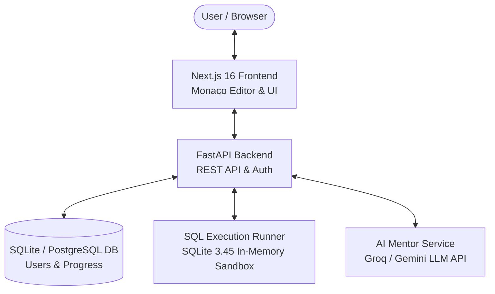

# ⚡ SQL Quest — 250 Relational Database & SQL Masterclass Platform

[](https://github.com/Spidey173/SQL)
[](https://nextjs.org/)
[](https://react.dev/)
[](https://fastapi.tiangolo.com/)
[](https://sqlite.org/)
[](LICENSE)

**SQL Quest** is an interactive, precision-machined engineering workspace designed to help developers master essential SQL queries, relational joins, subqueries, CTEs, and window functions for technical database interviews.

---

## 🔗 Quick Start & Local Execution

Start both the FastAPI backend (port 8000) and Next.js frontend (port 3000) with a single command:

```bash
./run.sh
```

---

## 📐 Architecture & System Design



### Why this Architecture?
- **Next.js 16**: Handles fast UI rendering, client-side state, and Monaco editor integration.
- **FastAPI**: Exposes high-performance async REST APIs with automatic OpenAPI schema validation.
- **SQLite 3.45 Sandbox**: Evaluates SQL queries safely in isolated in-memory database instances.
- **AI Service**: Generates instant hints, SQL query explanations, and execution plan feedback.

---

## 📁 Folder Structure

```text
Study/
├── frontend/                  # Next.js 16 Web Application
│   ├── src/
│   │   ├── app/              # App Router Pages (Dashboard, Curriculum, Workspace, Profile)
│   │   ├── components/       # UI Components (Cards, SchemaViewer, Monaco SQL Editor, Modals)
│   │   ├── hooks/            # Custom React Hooks
│   │   └── lib/              # API Client, Auth Context & Utilities
│   ├── public/               # Static Assets
│   └── package.json
│
└── backend/                   # FastAPI Backend Service
    ├── app/
    │   ├── ai/               # Copilot & LLM Integrations
    │   ├── routers/          # API Route Endpoints (Auth, Challenges, Execution)
    │   ├── models.py         # SQLAlchemy Database Models
    │   ├── schemas.py        # Pydantic Schemas & Validation
    │   └── main.py           # FastAPI Application Entry Point
    ├── tests/                # Pytest Backend Unit & Integration Tests
    └── requirements.txt
```

---

## 🌟 Key Features

- 🎯 **250 Relational SQL Masterclass Challenges**: Structured across 12 modules covering Projections, Aggregates, GROUP BY, Joins, Subqueries, Window Functions, CTEs, and CASE Expressions.
- 🎙️ **Spoken Interview Q&As**: Practical interview questions and scripts for each problem.
- ⚡ **Instant SQLite Sandbox**: Run SQL queries with schema previews and result tables directly in the browser.
- 🎮 **Gamification & Auth**: XP points, daily streaks, persistent user sessions, and module progression telemetry.

---

## 🛠️ Tech Stack

- **Frontend**: Next.js 16, React 19, Tailwind CSS, Monaco SQL Editor
- **Backend**: Python 3.14, FastAPI, SQLAlchemy, SQLite 3.45
- **Testing**: Pytest & Next.js Turbopack build verification
