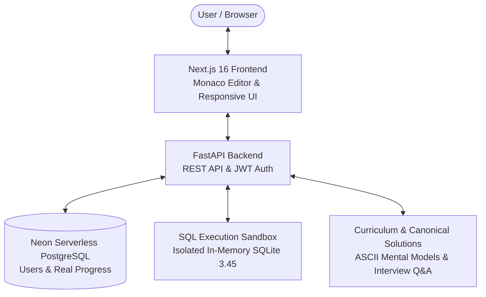

# ⚡ SQL Quest — 100 Relational Database & SQL Masterclass Platform

[](https://sql-quest-frontend.vercel.app)
[](https://sql-quest-backend.vercel.app/health)
[](https://nextjs.org/)
[](https://react.dev/)
[](https://fastapi.tiangolo.com/)
[](https://sqlite.org/)
[](LICENSE)

**SQL Quest** is an interactive, precision-machined engineering workspace designed to help developers master essential SQL queries, relational joins, subqueries, CTEs, and window functions for technical database interviews.

---

## 🌐 Live Hosted Deployment

The platform is fully deployed and available online:

| Service | Endpoint | Description |
| :--- | :--- | :--- |
| **Frontend Web App** | [https://sql-quest-frontend.vercel.app](https://sql-quest-frontend.vercel.app) | Production Next.js 16 UI with Monaco SQL Editor |
| **Backend REST API** | [https://sql-quest-backend.vercel.app](https://sql-quest-backend.vercel.app) | High-performance FastAPI serverless engine |
| **Interactive API Docs** | [https://sql-quest-backend.vercel.app/docs](https://sql-quest-backend.vercel.app/docs) | Swagger UI for exploring and testing API endpoints |
| **Health Check** | [https://sql-quest-backend.vercel.app/health](https://sql-quest-backend.vercel.app/health) | Live backend and Neon database connectivity telemetry |

---

## 🔗 Quick Start & Local Execution

Start both the FastAPI backend (port `8000`) and Next.js frontend (port `3000`) with a single command:

```bash
./run.sh
```

Or run each service individually:

### Backend
```bash
cd backend
python3 -m venv venv && source venv/bin/activate
pip install -r requirements.txt
uvicorn app.main:app --reload --port 8000
```

### Frontend
```bash
cd frontend
npm install
npm run dev
```

---

## 📐 Architecture & System Design



### Architectural Highlights
- **Next.js 16 & React 19**: Ultra-fast SSR/client-side state management, Monaco code editor, keyboard shortcuts (`Ctrl+Enter`), and dark terminal aesthetics.
- **FastAPI Backend**: Asynchronous endpoints with Pydantic validation, JWT authentication, and Neon serverless PostgreSQL integration.
- **Two-Phase SQLite 3.45 Sandbox**: Separates database DDL/schema building (`schema.sql`) from query solution execution (`solution.sql`).
- **Comprehensive Solution Vault**: Includes ASCII mental models, execution order, beginner traps, complexity benchmarks, and spoken interview scripts for every challenge.

---

## 📁 Folder Structure

```text
Study/
├── frontend/                  # Next.js 16 Web Application
│   ├── src/
│   │   ├── app/              # App Router (Dashboard, Curriculum, Quest Workspace, Telemetry)
│   │   ├── components/       # UI Components (Monaco Editor, SchemaViewer, InterviewPanel)
│   │   ├── hooks/            # Custom React Hooks & Shortcuts
│   │   └── lib/              # API Client, Auth Context, Persistence & Solution Data
│   ├── public/               # Static Assets & Icons
│   └── package.json
│
└── backend/                   # FastAPI Backend Service
    ├── api/                  # Vercel Serverless Entry Point (index.py)
    ├── app/
    │   ├── routers/          # API Route Handlers (auth, challenges, execution, profile, admin)
    │   ├── database.py       # Neon PostgreSQL / SQLite async engine
    │   ├── models.py         # SQLAlchemy ORM Models
    │   ├── schemas.py        # Pydantic Schemas & Validations
    │   └── main.py           # FastAPI Application Entry Point
    ├── tests/                # Pytest Backend Unit & Integration Tests
    ├── vercel.json           # Vercel Python Builder Configuration
    └── requirements.txt
```

---

## 🌟 Key Features

- 🎯 **100 Curated Relational SQL Challenges**: Structured progressively across Projections, Aggregates, GROUP BY, Having, Joins, Self-Joins, Subqueries, Window Functions, and CTEs.
- 🧠 **Intuitive Mental Models & Line-by-Line Breakdowns**: Step-by-step ASCII query execution pipelines, logical execution orders, and common beginner pitfalls.
- 🎙️ **Spoken Interview Q&As**: Real interview follow-ups comparing alternative approaches (e.g., correlated subqueries vs. joins vs. window functions).
- ⚡ **Instant In-Browser Sandbox**: Real SQLite execution with live column/row output grids, runtime telemetry, and auto-test verification.
- 🔥 **Daily Practice Streak & Telemetry**: Dynamic streak tracking based on real submission timestamps, acceptance rates, and benchmark metrics.

---

## 🛠️ Tech Stack

- **Frontend**: Next.js 16, React 19, Tailwind CSS 4, Monaco Editor, Lucide Icons, Canvas Confetti
- **Backend**: Python 3.14, FastAPI, SQLAlchemy 2.0 (Async), Pydantic v2
- **Database**: Neon Serverless PostgreSQL (Production) / SQLite 3.45 (Local & Execution Sandbox)
- **Deployment**: Vercel (Frontend & Python Serverless Functions)
- **Testing**: Pytest (15 automated tests passing) & Next.js Turbopack verification
